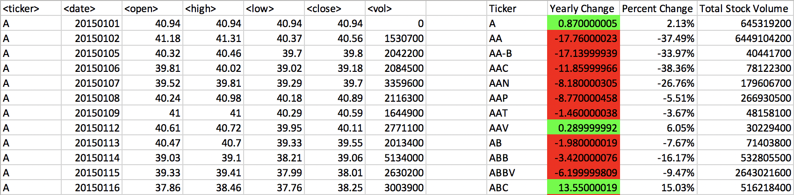
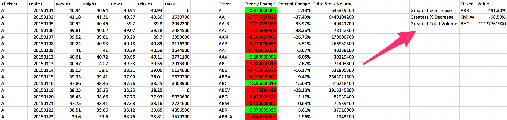

# The VBA of Wall Street

## Background

The objective of this project is to use VBA scripting to analyze real stock market data. 

### Task-1

* Create a script that will loop through one year of stock data for each run and return the total volume each stock had over that year.

* Display the ticker symbol to coincide with the total stock volume.

### Task-2

  * Yearly change from opening price at the beginning of a given year to the closing price at the end of that year.

  * The percent change from opening price at the beginning of a given year to the closing price at the end of that year.

  * The total stock volume of the stock.

### Task-3

* Calculate "Greatest % increase", "Greatest % Decrease" and "Greatest total volume".

